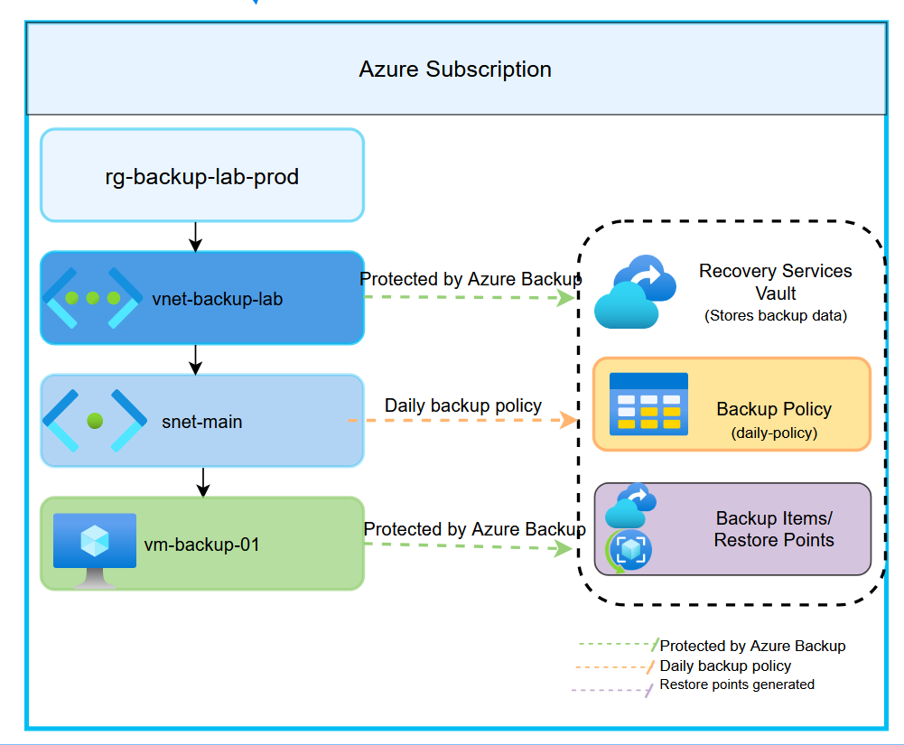

# Azure VM Backup & Recovery Lab

##  Project Overview
This project demonstrates how to protect an Azure Virtual Machine using Azure Backup with a Recovery Services Vault and a daily backup policy.

##  Architecture Diagram

##  Technologies Used
- Azure Virtual Machines
- Azure Virtual Network (VNet)
- Recovery Services Vault
- Azure Backup
- Backup Policies

##  Key Components
- **VM:** vm-backup-01
- **Resource Group:** rg-backup-lab-prod
- **VNet:** vnet-backup-lab
- **Subnet:** snet-main
- **Backup Vault:** Recovery Services Vault
- **Backup Policy:** Daily backup policy

##  Backup Workflow
1. Virtual Machine is deployed inside a subnet
2. Recovery Services Vault is created
3. Backup policy is configured (daily backups)
4. VM is protected by Azure Backup
5. Restore points are automatically generated

##  Key Learnings
- How Azure Backup protects virtual machines
- Difference between backup policy and restore points
- How Recovery Services Vault manages backup data
- Real-world disaster recovery concepts

##  Outcome
Successfully configured Azure VM backup and validated restore points for recovery scenarios.
---

##  Outcome
Successfully implemented and validated a complete Azure VM backup and recovery solution.
